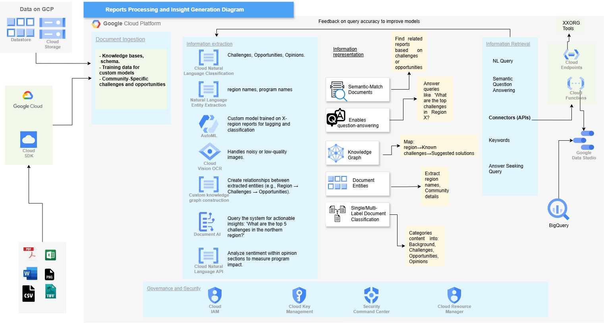

# Reports Processing and Insight Generation Diagram

This project presents a cloud-based architecture designed to process, analyze, and generate insights from structured and unstructured reports. It provides an automated pipeline that ingests multiple data types, extracts valuable insights, and makes them accessible through dashboards and APIs for further analysis and decision-making.

## Key Features

1. **Multi-Format Data Ingestion**
    - Supports file formats such as PDF, Word, Excel, PNG, CSV, and TIFF.
    - Data is uploaded and stored in **Google Cloud Storage** using the **Cloud SDK**.

2. **Document Ingestion**
    - Utilizes knowledge bases and schemas to categorize data effectively.
    - Includes training data for custom machine learning models.
    - Tailored to identify specific challenges, opportunities, and community insights.

3. **Information Extraction**
    - **Cloud Natural Language Classification**: Categorizes content into relevant themes like challenges, opportunities, and opinions.
    - **Natural Language Entity Extraction**: Identifies key entities such as region names and program details.
    - **AutoML**: Custom machine learning models for tagging and classification.
    - **Cloud Vision OCR**: Extracts text from scanned or low-quality images.
    - **Custom Knowledge Graph Construction**: Maps relationships between data entities (e.g., regions and challenges).
    - **Document AI and Sentiment Analysis**: Evaluates sentiments to assess program impact.

4. **Information Representation**
    - **Semantic Match Documents**: Identifies related reports based on extracted content.
    - **Question Answering**: Supports natural language queries like "What are the top challenges in a specific region?"
    - **Knowledge Graph**: Visualizes relationships between entities for deeper insights.
    - **Document Entities**: Extracts structured metadata for analysis.
    - **Single/Multi-Label Document Classification**: Categorizes content into predefined themes such as background, challenges, opportunities, and opinions.

5. **Information Retrieval**
    - Exposes APIs through **Cloud Endpoints** and **Cloud Functions** for seamless integration with external tools.
    - Enables keyword searches, natural language queries, and detailed Q&A functionality.

6. **Visualization and Insights**
    - Processes and stores structured data in **BigQuery** for analysis.
    - Provides interactive dashboards and reports using **Google Data Studio**.

7. **Feedback Loop**
    - Integrates feedback from users to improve the system's accuracy over time.
    - Enhances machine learning models with retraining based on real-world data.

8. **Governance and Security**
    - Implements **Cloud IAM**, **Key Management**, and **Security Command Center** for robust security and compliance.

## Architecture Overview

The architecture is divided into the following key components:

1. **Data Sources**: Accepts diverse file formats from field reports.
2. **Cloud Storage**: Centralized repository for storing uploaded files.
3. **Document Ingestion**: Prepares and categorizes data using machine learning and predefined schemas.
4. **Information Extraction**: Processes reports to extract meaningful insights using natural language processing and OCR.
5. **Information Representation**: Structures extracted data into useful formats like graphs, document classifications, and semantic matches.
6. **Information Retrieval**: Provides an interface for querying data and retrieving insights.
7. **Visualization**: Displays trends and insights through dashboards.
8. **Security and Governance**: Ensures data integrity and privacy through robust security measures.

## Use Cases

- Automated processing of large volumes of reports.
- Extracting actionable insights for decision-making.
- Interactive dashboards for trend analysis and reporting.
- Querying structured data for detailed insights.

## Technologies Used

- **Google Cloud Platform (GCP)**:
  - Cloud Storage, BigQuery, Data Studio, Cloud Functions, Cloud Endpoints
- **AI and Machine Learning**:
  - AutoML, Cloud Vision OCR, Natural Language API, Document AI
- **Governance and Security**:
  - Cloud IAM, Key Management, Security Command Center

## Future Improvements

- Incorporate additional data sources and formats.
- Expand machine learning models for more precise entity extraction.
- Enhance dashboards with predictive analytics.
- Introduce multilingual support for reports in different languages.

## How to Use

1. Upload files to Google Cloud Storage via the Cloud SDK.
2. Use APIs to query processed data or retrieve insights.
3. Access dashboards in Google Data Studio for trend analysis.
4. Provide feedback through the interface to improve system accuracy.

---

This architecture demonstrates a robust, scalable, and secure solution for processing and analyzing large volumes of reports, offering actionable insights and efficient data management capabilities.
